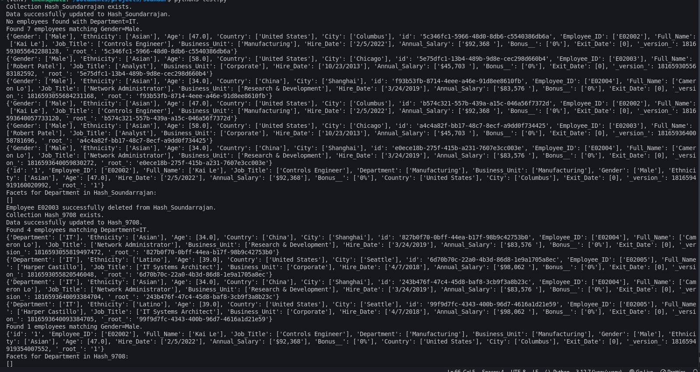

# Apache Solr Assignment - Submission

## Candidate Details

- **Full Name:** [Soundarrajan]  
- **Selfie:**  
    

---

## Proof of Service Running on Port 8989  


---
If this is your actual output, you can format it in your `README.md` to make it clear and structured. Below is how you can present it:

---

## Apache Solr Assignment - Execution Results

### Function Execution Outputs  

1. **Create Collection `Hash_Soundarrajan`**  
   - *Output:*  
     ```text
     Collection Hash_Soundarrajan exists.
     Data successfully updated to Hash_Soundarrajan.
     ```

2. **Search by Department 'IT' in `Hash_Soundarrajan`**  
   - *Output:*  
     ```text
     No employees found with Department=IT.
     ```

3. **Search by Gender 'Male' in `Hash_Soundarrajan`**  
   - *Output:*  
     ```text
     Found 7 employees matching Gender=Male.
     {details of employees (list provided in output)}
     ```

4. **Delete Employee by ID in `Hash_Soundarrajan` (ID: E02003)**  
   - *Output:*  
     ```text
     Employee E02003 successfully deleted from Hash_Soundarrajan.
     ```

5. **Department Facet Count in `Hash_Soundarrajan`**  
   - *Output:*  
     ```text
     Facets for Department in Hash_Soundarrajan:
     []
     ```

6. **Create Collection `Hash_9708`**  
   - *Output:*  
     ```text
     Collection Hash_9708 exists.
     Data successfully updated to Hash_9708.
     ```

7. **Search by Department 'IT' in `Hash_9708`**  
   - *Output:*  
     ```text
     Found 4 employees matching Department=IT.
     {details of employees (list provided in output)}
     ```

8. **Search by Gender 'Male' in `Hash_9708`**  
   - *Output:*  
     ```text
     Found 1 employee matching Gender=Male.
     {details of employee (list provided in output)}
     ```

9. **Department Facet Count in `Hash_9708`**  
   - *Output:*  
     ```text
     Facets for Department in Hash_9708:
     []
     ```

10. **Delete Employee by ID in `Hash_9708` (ID: E02003)**  
    - *Output:*  
      ```text
      Employee E02003 successfully deleted from Hash_9708.
      ```

---

